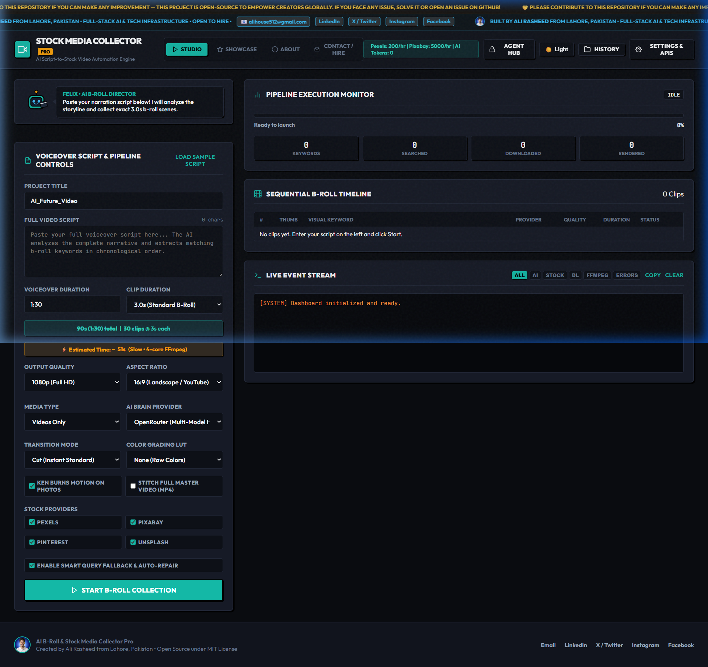
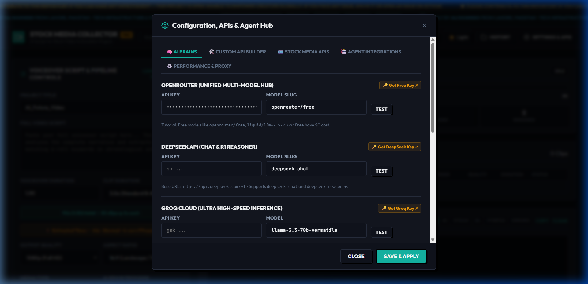
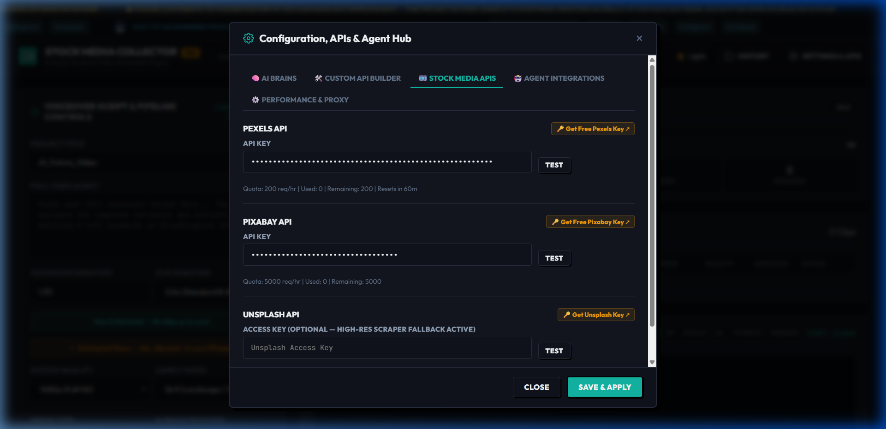
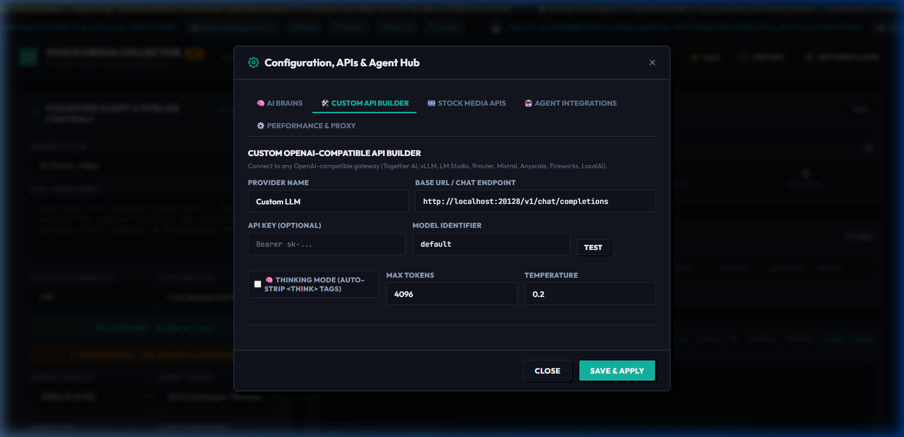
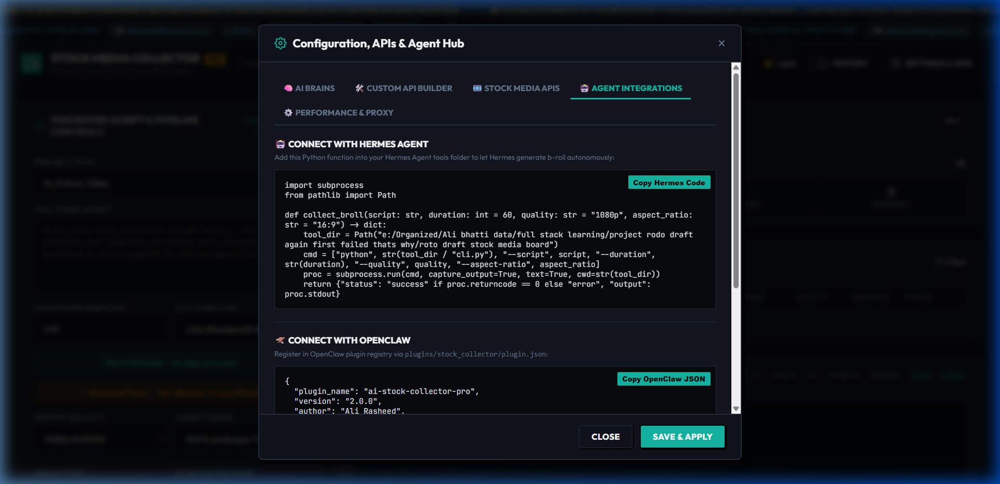

<div align="center">

# 🎬 RotoDraft Suite
### Automatic Script to B-Roll and Asset Collector Engine
**The #1 Free, Local-First, Open-Source Alternative to Pictory AI, InVideo AI & MoneyPrinter Turbo**

<p align="center">
  
  
  
  
  
  
  
</p>

<p align="center">
  <strong>Transform raw voiceover scripts and narrative text into timeline-ready, exact 3.0-second 1080p/4K stock b-roll video clips in seconds. Features DeepSeek-R1 reasoning monologue parsing, 9 parallel stock media vaults, local FFmpeg hardware acceleration, and 1-click NLE project exports for Premiere Pro, DaVinci Resolve, and CapCut.</strong>
</p>

<p align="center">
  <a href="#-quick-start-in-60-seconds">Quick Start</a> •
  <a href="#-why-rotodraft-suite-comparison-matrix">Comparison Matrix</a> •
  <a href="#-key-features">Key Features</a> •
  <a href="#-step-by-step-visual-tutorial">Tutorial</a> •
  <a href="#-nle-video-editor-export-guides">NLE Guides</a> •
  <a href="#-agent--cli-integrations">Agent Skills</a> •
  <a href="#-privacy--security-guarantee">Privacy</a> •
  <a href="#-creator--maintainer">Author</a>
</p>

---



</div>

---

## ⚡ Why RotoDraft Suite? (Comparison Matrix)

| Feature | 🚫 Pictory AI ($49/mo) | 🚫 InVideo AI ($35/mo) | ⚠️ MoneyPrinter Turbo | 🚀 **RotoDraft Suite ($0 Free)** |
| :--- | :--- | :--- | :--- | :--- |
| **Monthly Cost** | $49 / month | $35 / month | Free | **$0.00 (100% Free & Open Source)** |
| **AI Reasoning Models** | ❌ Locked GPT-3.5 | ❌ Proprietary | Basic OpenAI | **✅ Full DeepSeek-R1, OpenRouter, Groq, Claude 3.5, Gemini 1.5, Ollama** |
| **Thinking Monologue** | ❌ None | ❌ None | ❌ None | **✅ Auto-Strips `<think>` Tags & Reasoning Tokens cleanly** |
| **Stock Media Vaults** | 1 (Storyblocks only) | 1 (Shutterstock only) | 2 (Pexels, Pixabay) | **✅ 9 Vaults: Pexels, Pixabay, Coverr, Mixkit, Storyblocks, Videvo, Pinterest, Unsplash, Wikimedia** |
| **NLE Timeline Exports** | ❌ None | ❌ None | ❌ None | **✅ Adobe Premiere Pro XML, DaVinci Resolve EDL, CapCut Draft JSON, CSV** |
| **Ken Burns Photo Engine**| Basic Zoom | Basic Zoom | Static | **✅ Mathematical 2.5D Ken Burns Dynamic Pan & Zoom on Photos** |
| **Custom AI Builder** | ❌ None | ❌ None | ❌ None | **✅ Any OpenAI-Compatible Endpoint (vLLM, LM Studio, Together, Ollama)** |
| **Data Privacy** | ❌ Cloud Server Upload | ❌ Cloud Server Upload | Local | **✅ 100% Local-First (Keys & Videos NEVER leave your PC)** |
| **AI Error Doctor** | ❌ Generic Error | ❌ Generic Error | Terminal Crash | **✅ Built-in AI Medical Diagnosis for FFmpeg, Network, & Quotas** |
| **Agent Ecosystem** | ❌ None | ❌ None | ❌ None | **✅ Hermes Agent, OpenClaw, Claude Code & Codex Native Skills** |

---

## 🏗️ System Architecture & Workflow

```
                       ┌─────────────────────────────────┐
                       │    VOICEOVER SCRIPT INPUT       │
                       │ (60s -> 20 scenes @ 3.0s each)  │
                       └────────────────┬────────────────┘
                                        │
                                        ▼
                    ┌────────────────────────────────────────┐
                    │           AI BRAIN ENGINE              │
                    │ • DeepSeek-R1 (Thinking Monologue)     │
                    │ • OpenRouter / Groq / Claude / Gemini  │
                    │ • Custom Endpoint / Ollama Local       │
                    │ • Auto-Strips <think> Tags -> JSON     │
                    └───────────────────┬────────────────────┘
                                        │
                                        ▼
                    ┌────────────────────────────────────────┐
                    │       9 PARALLEL STOCK VAULTS          │
                    │ • Pexels API (200 req/hr free)         │
                    │ • Pixabay API (5,000 req/hr free)      │
                    │ • Coverr.co (Free HD/4K Video CDN)     │
                    │ • Mixkit.co (Envato Free B-Roll)       │
                    │ • Storyblocks API (Enterprise Stock)   │
                    │ • Videvo.net & Wikimedia Commons       │
                    │ • Pinterest 9:16 & 1080p Video Scraper │
                    └───────────────────┬────────────────────┘
                                        │
                                        ▼
                    ┌────────────────────────────────────────┐
                    │     LOCAL FFMPEG HARDWARE ENGINE       │
                    │ • Exact 3.0s duration trimming         │
                    │ • Smart aspect ratio cropping (16:9)   │
                    │ • 2.5D Ken Burns Photo Animation       │
                    │ • Color grading LUTs & Transitions     │
                    │ • Full Master Video Concatenation      │
                    └───────────────────┬────────────────────┘
                                        │
                                        ▼
                    ┌────────────────────────────────────────┐
                    │       1-CLICK NLE EXPORT SUITE         │
                    │ • Adobe Premiere Pro (XML Timeline)    │
                    │ • DaVinci Resolve (CMX 3600 EDL)       │
                    │ • CapCut Desktop (Draft Project JSON)  │
                    │ • CSV Timecode Sequence Sheet          │
                    └────────────────────────────────────────┘
```

---

## 🚀 Quick Start in 60 Seconds

### Step 1: Clone Repository
```bash
git clone https://github.com/AliRash3ed/rotodraft-suite.git
cd rotodraft-suite
```

### Step 2: Install Dependencies
```bash
pip install -r requirements.txt
```

### Step 3: Run the Web Studio
```bash
# Windows 1-Click Launch:
START_TOOL.bat

# Or via Python terminal:
python app.py
```
Open **`http://localhost:8001`** in your browser.

---

## 🖥️ User Interface Tour

<div align="center">

### AI Brains Configuration & Model Selection


### Stock Media Vaults & Live Quota Monitoring


### Custom OpenAI-Compatible LLM Builder


### Agent Hub & Automation Guide


</div>

---

## 🎬 Step-by-Step Visual Tutorial

### 1. Paste Your Voiceover Script
Type or paste your narrative script into the Script text area. Choose your target video duration (e.g. 60 seconds) and clip pacing (e.g. 3.0s per clip = 20 visual scenes).

### 2. Configure Your AI Brain
Select your preferred AI provider:
- **OpenRouter** (Models like `minimax/minimax-m3:free`, `deepseek/deepseek-r1`, `anthropic/claude-3.5-sonnet`)
- **DeepSeek** (`deepseek-chat`, `deepseek-reasoner`)
- **Groq** (`llama-3.3-70b-versatile`)
- **Google Gemini** (`gemini-1.5-flash`, `gemini-1.5-pro`)
- **OpenAI** (`gpt-4o`, `gpt-4o-mini`, `o1`, `o3-mini`)
- **Ollama Local** (`llama3.2`, `mistral`, `qwen2.5`)

### 3. Select Stock Media Providers
Toggle on your desired stock footage sources:
- `Pexels` (Free 1080p/4K footage)
- `Pixabay` (Free nature, technology & motion graphics)
- `Coverr.co` (Free CDN high-speed stock)
- `Mixkit.co` (Envato free b-roll library)
- `Pinterest` (Aesthetic vertical & horizontal reels)

### 4. Click 'Start B-Roll Collection'
Watch the real-time event stream as RotoDraft Suite:
1. Breaks the script into chronological visual scenes.
2. Queries the 9 stock vaults in parallel with automatic fallback keyword rewriting.
3. Downloads media streams concurrently with multi-worker threading.
4. Trims each clip to exact 3.0s duration via local FFmpeg.
5. Concatenates the clips into a **Full Master Video MP4**.
6. Generates timeline projects for **Premiere Pro**, **DaVinci Resolve**, and **CapCut**.

---

## 🎞️ NLE Video Editor Export Guides

### 1. Adobe Premiere Pro
1. Open Adobe Premiere Pro.
2. Go to **File** &rarr; **Import...** (or `Ctrl+I` / `Cmd+I`).
3. Select the generated `..._premiere_davinci.xml` from your project folder.
4. Premiere Pro will instantly recreate your multi-clip sequence with exact cuts, in-points, and out-points on the timeline!

### 2. DaVinci Resolve
1. Open DaVinci Resolve & Create a New Project.
2. Go to **File** &rarr; **Import** &rarr; **Timeline...** (or `Ctrl+Shift+I`).
3. Select `..._davinci.edl` or `..._premiere_davinci.xml`.
4. Point the source media directory to the `clips/` folder. All 1080p clips align automatically on Video Track 1.

### 3. CapCut Desktop
1. Open CapCut Desktop.
2. Copy the generated `..._capcut_draft.json` into your local CapCut Projects folder:
   - **Windows**: `C:\Users\YOUR_USER\AppData\Local\CapCut\User Data\Projects\com.lveditor.draft\`
   - **macOS**: `~/Movies/CapCut/User Data/Projects/com.lveditor.draft/`
3. Launch CapCut — your project opens with all clips cut and placed on the timeline.

---

## 💻 CLI Terminal Wizard

For headless servers, automation scripts, and Docker containers:

```bash
# Basic Run (30s Video)
python cli.py --script "Robotic automation in high tech laboratory." --duration 30

# Full Master Video Concatenation + 9 Stock Providers
python cli.py --script "Inside data centers, AI servers process petabytes." --duration 45 --quality 1080p --aspect-ratio 16:9 --providers pexels,pixabay,coverr,mixkit --full-video

# Headless Batch Run using a script file
python cli.py --script path/to/voiceover.txt --duration 90 --quality 4K --aspect-ratio 9:16

# Launch Interactive Terminal Wizard
python cli.py --interactive

# Print Agent Integration Code
python cli.py --agent-help
```

---

## 🤖 Agent & CLI Integrations

### Hermes Agent Integration
```python
import subprocess
from pathlib import Path

def collect_broll(script: str, duration: int = 60, quality: str = "1080p") -> dict:
    """Invokes RotoDraft Suite autonomous pipeline from Hermes Agent."""
    tool_dir = Path(__file__).resolve().parent
    cmd = ["python", str(tool_dir / "cli.py"), "--script", script, "--duration", str(duration), "--quality", quality, "--full-video"]
    proc = subprocess.run(cmd, capture_output=True, text=True, cwd=str(tool_dir))
    return {"status": "success" if proc.returncode == 0 else "error", "output": proc.stdout}
```

### OpenClaw Plugin Manifest (`tool_plugin.json`)
```json
{
  "plugin_name": "rotodraft-suite",
  "version": "2.0.0",
  "author": "Ali Rasheed",
  "entrypoint": "cli.py",
  "capabilities": ["script_analysis", "stock_search", "ffmpeg_rendering", "nle_export"]
}
```

---

## 🔒 Privacy & Security Guarantee

- **Zero Cloud Tracking**: All API keys, narration scripts, and downloaded footage stay strictly on your local computer.
- **`.gitignore` Protection**: Your `.env`, `data/saved_settings.json`, and `downloads/` directory are completely ignored by git.
- **Self-Healing AI Error Doctor**: If FFmpeg is missing or rate limits occur, the built-in Error Doctor diagnoses the exact OS fix and provides 1-click retry.

---

## 🧪 Running Automated Tests

Run the full unit and integration test suite:
```bash
python tests/test_suite.py
```
```
.........
----------------------------------------------------------------------
Ran 9 tests in 0.281s

OK
```

---

## 👨‍💻 Creator & Maintainer

Built with ❤️ by **Ali Rasheed** from Lahore, Pakistan.  
Full-Stack AI Developer & Tech Infrastructure Engineer.

- 📧 **Email**: [alihouse512@gmail.com](mailto:alihouse512@gmail.com)
- 💼 **LinkedIn**: [linkedin.com/in/alirasheedbhatt](https://www.linkedin.com/in/alirasheedbhatt)
- 🐦 **X / Twitter**: [@AliRasheedBti](https://x.com/AliRasheedBti)
- 📸 **Instagram**: [@this_is_ali_r](https://www.instagram.com/this_is_ali_r/)
- 🌐 **Facebook**: [Ali Rasheed](https://www.facebook.com/profile.php?id=61579456175357)

---

## 📄 License

Distributed under the **MIT License**. Free for commercial and personal use forever.
See [LICENSE](LICENSE) for details.
