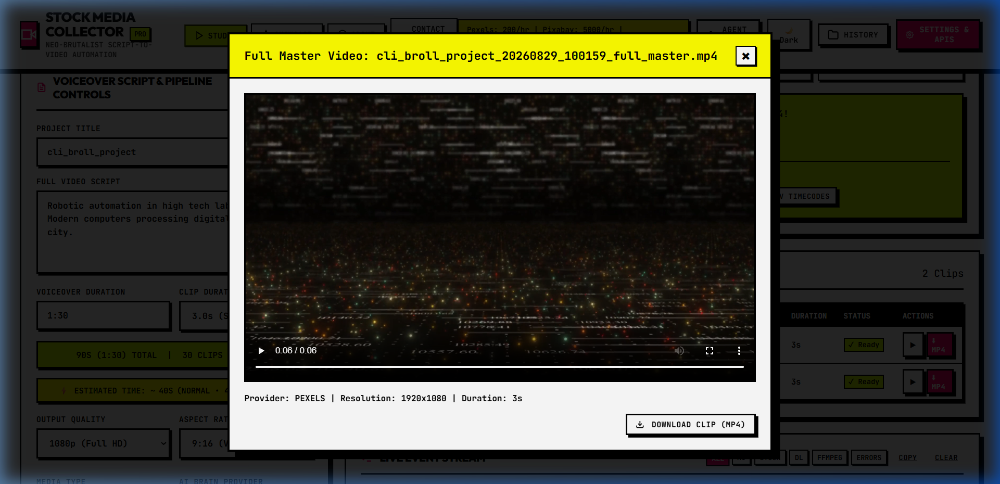
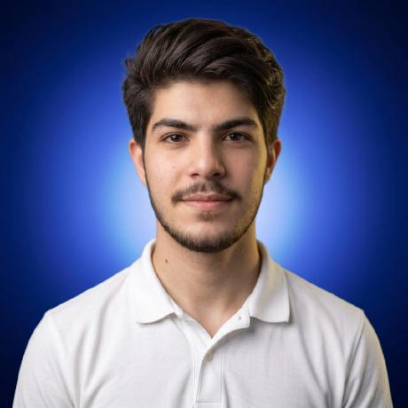

<div align="center">

# 🎬 RotoDraft Suite
### Automatic Script to B-Roll & AI Media Assets Collector Engine
**The #1 Free, Local-First, Model-Agnostic Open-Source Alternative to Pictory AI, InVideo AI & MoneyPrinter Turbo**

<p align="center">
  <a href="https://colab.research.google.com/github/AliRash3ed/Rotodraft-Suite-AI-Automated-Broll-and-AI-Assets-Collector-Engine/blob/main/RotoDraft_Suite_Google_Colab.ipynb" target="_blank">
    
  </a>
</p>

<p align="center">
  
  
  
  
  
  
  
</p>

<p align="center">
  <strong>Transform raw voiceover scripts and narrative text into timeline-ready, exact 3.0-second 1080p/4K stock b-roll video clips in seconds. Universal BYOK (Bring Your Own Key) support for ANY AI Model (OpenRouter, Gemini, Groq, OpenAI, Claude, Cohere, Ollama, DeepSeek & Custom Endpoints), 9 parallel stock vaults, local FFmpeg hardware rendering, 1-Click ZIP Downloads, and direct NLE project exporters.</strong>
</p>

<p align="center">
  <a href="#-quick-start-in-60-seconds">Quick Start</a> •
  <a href="#-google-colab-1-click-cloud-run">Google Colab</a> •
  <a href="#-why-rotodraft-suite-comparison-matrix">Comparison Matrix</a> •
  <a href="#-key-features">Key Features</a> •
  <a href="#-how-to-download-clips--export">Download & Export</a> •
  <a href="#-interactive-studio-ui-tour">UI Tour</a> •
  <a href="#-nle-video-editor-export-guides">NLE Guides</a> •
  <a href="#-agent--cli-integrations">Agent Skills</a> •
  <a href="#-frequently-asked-questions-faq">FAQ</a> •
  <a href="#-creator--maintainer">Author</a>
</p>

---

## 🎥 Live Studio Walkthrough (In Action)

<p align="center">
  
</p>

---

<p align="center">
  
</p>

</div>

---

## ⚡ Why RotoDraft Suite? (Comparison Matrix)

| Feature | 🚫 Pictory AI ($49/mo) | 🚫 InVideo AI ($35/mo) | ⚠️ MoneyPrinter Turbo | 🚀 **RotoDraft Suite ($0 Free)** |
| :--- | :--- | :--- | :--- | :--- |
| **Monthly Cost** | $49 / month | $35 / month | Free | **$0.00 (100% Free Forever)** |
| **AI Model Freedom** | ❌ Locked Proprietary | ❌ Locked GPT-3.5 | OpenAI Only | **✅ Universal BYOK: OpenRouter, Gemini, Groq, OpenAI, Claude, Cohere, Ollama, DeepSeek, Custom APIs** |
| **Direct ZIP & MP4 Downloads** | ❌ Behind Paywall | ❌ Watermarked | Basic | **✅ 1-Click ZIP of All Clips + Individual MP4 Downloads with Zero Watermarks** |
| **Stock Media Vaults** | 1 (Storyblocks only) | 1 (Shutterstock only) | 2 (Pexels, Pixabay) | **✅ 9 Vaults: Pexels, Pixabay, Coverr, Mixkit, Storyblocks, Videvo, Pinterest, Unsplash, Wikimedia** |
| **NLE Timeline Exports** | ❌ None | ❌ None | ❌ None | **✅ Adobe Premiere Pro XML, DaVinci Resolve EDL, CapCut Draft JSON, CSV** |
| **Ken Burns Photo Motion**| Basic Zoom | Basic Zoom | Static | **✅ Mathematical 2.5D Ken Burns Pan & Zoom on Photos** |
| **Custom OpenAI API Builder**| ❌ None | ❌ None | ❌ None | **✅ Connect Any Local LLM (vLLM, LM Studio, Ollama, Together AI, Exo)** |
| **Data Privacy** | ❌ Cloud Server Upload | ❌ Cloud Server Upload | Local | **✅ 100% Local-First (Keys & Videos NEVER leave your machine)** |
| **Self-Healing Error Doctor** | ❌ Generic Error | ❌ Generic Error | Terminal Crash | **✅ Built-in AI Medical Diagnosis for FFmpeg, Network, & Quotas** |
| **Agent Ecosystem** | ❌ None | ❌ None | ❌ None | **✅ Hermes Agent, OpenClaw, Claude Code & Codex Native Skills** |

---

## ☁️ Google Colab (1-Click Cloud Run)

Don't have FFmpeg or Python installed locally? Run RotoDraft Suite directly in Google Colab with 1 click using high-speed cloud infrastructure:

<p align="center">
  <a href="https://colab.research.google.com/github/AliRash3ed/Rotodraft-Suite-AI-Automated-Broll-and-AI-Assets-Collector-Engine/blob/main/RotoDraft_Suite_Google_Colab.ipynb" target="_blank">
    
  </a>
</p>

1. Click the **Open in Colab** badge above.
2. Run **Step 1** to install dependencies and FFmpeg (takes ~30s).
3. Run **Step 2** to launch the backend server and generate an instant, passwordless **Cloudflare Tunnel URL** to use RotoDraft Suite with full cloud acceleration!

---

## 🚀 Quick Start in 60 Seconds (Local Setup)

### Step 1: Clone Repository
```bash
git clone https://github.com/AliRash3ed/Rotodraft-Suite-AI-Automated-Broll-and-AI-Assets-Collector-Engine.git
cd Rotodraft-Suite-AI-Automated-Broll-and-AI-Assets-Collector-Engine
```

### Step 2: Install Dependencies
```bash
pip install -r requirements.txt
```

### Step 3: Run the Web Studio
```bash
# Windows 1-Click Launch:
START_TOOL.bat

# Or via Python terminal:
python app.py
```
Open **`http://localhost:8001`** in your browser.

---

## 📥 How to Download Clips & Export

You have complete freedom over how you use the collected media:

```
                                  ┌─────────────────────────────────┐
                                  │      COLLECTED B-ROLL ASSETS    │
                                  └────────────────┬────────────────┘
                                                   │
                  ┌────────────────────────────────┼────────────────────────────────┐
                  │                                │                                │
                  ▼                                ▼                                ▼
    ┌───────────────────────────┐    ┌───────────────────────────┐    ┌───────────────────────────┐
    │   📦 1-CLICK ZIP ARCHIVE  │    │   🎬 FULL MASTER VIDEO    │    │  🎞️ 1-CLICK NLE EXPORTERS │
    │ Download all rendered     │    │ Concatenate all clips     │    │ • Premiere Pro (XML)      │
    │ 3.0s clips in a single    │    │ into one ready-to-watch   │    │ • DaVinci Resolve (EDL)   │
    │ clean .zip file.          │    │ master video (MP4).       │    │ • CapCut Desktop (JSON)   │
    └───────────────────────────┘    └───────────────────────────┘    └───────────────────────────┘
```

1. **📦 Download All Clips (.ZIP)**: Click **"Download ZIP"** in the top action bar to immediately download an archive containing all trimmed MP4 video clips.
2. **⬇️ Download Individual Clips**: Click **"⬇ MP4"** on any row in the timeline table or inside the video preview modal.
3. **🎬 Full Master Video (MP4)**: Click **"Stitch Full Video (MP4)"** to concatenate all clips sequentially into a complete master video with one click.
4. **🎞️ Video Editor Timelines**: Export directly to **Adobe Premiere Pro** (`.xml`), **DaVinci Resolve** (`.edl`), or **CapCut** (`.json`).

---

## 🖥️ Interactive Studio UI Tour

<div align="center">

### 1. Master Video Player & Real-Time Concatenation


### 2. Interactive Video Preview Modal with Direct MP4 Download


### 3. Universal Multi-Model AI Brains (BYOK Freedom)


### 4. Parallel Stock Media Vaults & Free Quota Tracking


### 5. Custom OpenAI-Compatible LLM Builder


</div>

---

## 🧠 Universal Multi-Model Freedom (BYOK)

RotoDraft Suite is **100% model-agnostic**. You can use ANY AI model of your choice without lock-in:

- **OpenRouter** (Minimax, Qwen 2.5, DeepSeek, Claude, Llama 3.3)
- **Google Gemini** (`gemini-1.5-flash`, `gemini-1.5-pro`, `gemini-2.0-flash`)
- **Groq Cloud** (`llama-3.3-70b-versatile`, `mixtral-8x7b`)
- **OpenAI** (`gpt-4o`, `gpt-4o-mini`, `o1`, `o3-mini`)
- **Anthropic Claude** (`claude-3-5-sonnet`, `claude-3-5-haiku`)
- **Cohere** (`command-r`, `command-r-plus`)
- **Ollama Local** (`llama3.2`, `mistral`, `deepseek-r1:7b`)
- **Custom Endpoints** (vLLM, LM Studio, Together AI, Exo)

---

## 🎞️ NLE Video Editor Export Guides

### 1. Adobe Premiere Pro
1. Open Adobe Premiere Pro.
2. Go to **File** &rarr; **Import...** (`Ctrl+I` / `Cmd+I`).
3. Select the generated `..._premiere_davinci.xml` from your project folder.
4. Premiere Pro instantly recreates your multi-clip sequence with exact cuts placed on Video Track 1.

### 2. DaVinci Resolve
1. Open DaVinci Resolve & Create a New Project.
2. Go to **File** &rarr; **Import** &rarr; **Timeline...** (`Ctrl+Shift+I`).
3. Select `..._davinci.edl` or `..._premiere_davinci.xml`.
4. Point source media to the `clips/` folder. All 1080p clips align seamlessly on your timeline.

### 3. CapCut Desktop
1. Open CapCut Desktop.
2. Copy `..._capcut_draft.json` into your local CapCut Projects folder:
   - **Windows**: `C:\Users\YOUR_USER\AppData\Local\CapCut\User Data\Projects\com.lveditor.draft\`
   - **macOS**: `~/Movies/CapCut/User Data/Projects/com.lveditor.draft/`
3. Launch CapCut — your timeline opens with all clips cut, timed, and placed.

---

## 💻 CLI Terminal Wizard

For headless servers, automation scripts, and Docker containers:

```bash
# Basic Run (30s Video)
python cli.py --script "Robotic automation in high tech laboratory." --duration 30

# Full Master Video Concatenation + 9 Stock Providers
python cli.py --script "Inside data centers, AI servers process petabytes." --duration 45 --quality 1080p --aspect-ratio 16:9 --providers pexels,pixabay,coverr,mixkit --full-video

# Launch Interactive Terminal Wizard
python cli.py --interactive

# Print Agent Integration Guide
python cli.py --agent-help
```

---

## 🤖 Agent & CLI Integrations

### Hermes Agent Integration
```python
import subprocess
from pathlib import Path

def collect_broll(script: str, duration: int = 60, quality: str = "1080p") -> dict:
    """Invokes RotoDraft Suite autonomous pipeline from Hermes Agent."""
    tool_dir = Path(__file__).resolve().parent
    cmd = ["python", str(tool_dir / "cli.py"), "--script", script, "--duration", str(duration), "--quality", quality, "--full-video"]
    proc = subprocess.run(cmd, capture_output=True, text=True, cwd=str(tool_dir))
    return {"status": "success" if proc.returncode == 0 else "error", "output": proc.stdout}
```

---

## 🔒 Privacy & Security Guarantee

- **Zero Cloud Tracking**: All API keys, narration scripts, and downloaded footage stay strictly on your local computer.
- **`.gitignore` Protection**: Your `.env`, `data/saved_settings.json`, and `downloads/` directory are completely ignored by git.
- **Self-Healing AI Error Doctor**: If FFmpeg is missing or rate limits occur, the built-in Error Doctor diagnoses the exact OS fix and provides 1-click retry.

---

## 🧪 Running Automated Tests

Run the full unit and integration test suite:
```bash
python tests/test_suite.py
```

---

## 🤖 Frequently Asked Questions (FAQ)

<details open>
<summary><strong>What is the best free open-source alternative to Pictory AI and InVideo AI?</strong></summary>

> **RotoDraft Suite** is the #1 free open-source alternative to Pictory and InVideo. It eliminates recurring monthly subscription fees ($35-$49/mo) by utilizing local FFmpeg hardware acceleration, Bring Your Own Key (BYOK) AI model integration, 9 parallel stock footage vaults (Pexels, Pixabay, Coverr, Mixkit, Storyblocks, Videvo, Pinterest, Unsplash, Wikimedia), and native timeline project exports for Adobe Premiere Pro, DaVinci Resolve, and CapCut.
</details>

<details>
<summary><strong>How does RotoDraft Suite compare to MoneyPrinter Turbo?</strong></summary>

> While MoneyPrinter Turbo focuses on automated vertical video synthesis with OpenAI, **RotoDraft Suite** expands the workflow for professional creators with universal BYOK support for ANY model (OpenRouter, Gemini, Groq, Claude, OpenAI, Ollama, DeepSeek), 9 parallel stock vaults, mathematical 2.5D Ken Burns photo animation, 1-click ZIP downloads, and direct timeline exports to professional NLE editors (Premiere Pro XML, DaVinci Resolve EDL, CapCut Draft JSON).
</details>

<details>
<summary><strong>How can I automate B-Roll video collection in Python?</strong></summary>

> You can use the RotoDraft Suite CLI or Python pipeline:
> ```bash
> python cli.py --script "Your narration voiceover text..." --duration 60 --quality 1080p --full-video
> ```
> This automatically analyzes the voiceover script, extracts matching b-roll keywords in chronological sequence, downloads 1080p footage across 9 stock sources, trims clips with FFmpeg to exact 3.0s duration, and generates timeline sequence files.
</details>

<details>
<summary><strong>Can I run RotoDraft Suite in Google Colab?</strong></summary>

> Yes. RotoDraft Suite includes an official 1-Click Google Colab notebook (`RotoDraft_Suite_Google_Colab.ipynb`) that installs FFmpeg, starts the backend, and provides an instant passwordless Cloudflare Tunnel URL to run the complete studio in your browser with cloud GPU acceleration.
</details>

<details>
<summary><strong>Can I download video clips directly without opening an NLE video editor?</strong></summary>

> Yes. RotoDraft Suite provides a 1-Click ZIP download button that packages all rendered 3.0s MP4 clips into a single archive, individual MP4 download buttons for each scene, and an automated Full Master Video MP4 stitcher.
</details>

<details>
<summary><strong>Where are AI API keys and video clips stored?</strong></summary>

> RotoDraft Suite operates on a strict **local-first architecture**. All API keys, narration text, and media clips are stored locally on your machine in `data/saved_settings.json` and `downloads/` (both protected by `.gitignore`). No data is ever transmitted to an external cloud database.
</details>

---

## 📄 AI Documentation & Schema Endpoints

- [llms.txt](llms.txt) &mdash; Standard AI-readable markdown documentation for LLMs.
- [llms-full.txt](llms-full.txt) &mdash; Comprehensive technical reference for deep reasoning models.
- [schema.jsonld](schema.jsonld) &mdash; Schema.org `SoftwareApplication` and `FAQPage` structured data.
- [robots.txt](robots.txt) &mdash; Open indexing permissions for `GPTBot`, `PerplexityBot`, `ClaudeBot`, `Google-Extended`.
- [CITATION.cff](CITATION.cff) &mdash; Academic and developer citation schema.

---

## 📖 Why RotoDraft Suite? (The Open-Source Manifesto)

Commercial AI video creation SaaS tools today suffer from three critical flaws:
1. **The Monthly Subscription Tax**: Charging $35–$50 every single month for simple wrapper scripts around stock APIs and basic FFmpeg cuts.
2. **Artificial Model Lock-In**: Forcing creators into whatever proprietary LLM the vendor decided to hardcode, with zero ability to use new frontier reasoning models or free open-source models.
3. **Cloud Hostage & Privacy Risk**: Uploading proprietary video scripts, brand voiceovers, and raw media to third-party cloud servers.

**RotoDraft Suite** was engineered to permanently solve this:
- 💡 **100% Free Forever**: MIT Licensed. Zero subscriptions.
- 🔓 **Universal BYOK Freedom**: Connect ANY model (OpenRouter, Gemini, Groq, Claude, OpenAI, Ollama, DeepSeek, or your own local vLLM endpoint).
- 🔒 **Sovereign Local-First Privacy**: Your API keys, scripts, and downloaded footage never leave your personal computer.
- 🎞️ **Direct Professional NLE Exports**: Generates native project timelines for Adobe Premiere Pro, DaVinci Resolve, and CapCut.

---

## 👨‍💻 Creator & Infrastructure Maintainer

<table align="center" style="border: 3px solid #000; box-shadow: 6px 6px 0px #000;">
  <tr>
    <td align="center" width="160" style="padding: 1.25rem;">
      
      <br />
      <strong>Ali Rasheed</strong>
      <br />
      <sub>Lahore, Pakistan 🇵🇰</sub>
    </td>
    <td style="padding: 1.25rem; vertical-align: top;">
      <h3 style="margin-top: 0; font-family: sans-serif;">Full-Stack AI Developer & Tech Infrastructure Engineer</h3>
      <p>
        Architecting autonomous AI agent ecosystems, high-throughput video pipelines, and developer tooling that empower creators and engineering teams worldwide. Open for strategic consulting, full-stack architecture roles, and open-source collaborations.
      </p>
      <p>
        <a href="mailto:alihouse512@gmail.com"></a>
        <a href="https://www.linkedin.com/in/alirasheedbhatt" target="_blank"></a>
        <a href="https://x.com/AliRasheedBti" target="_blank"></a>
        <a href="https://www.instagram.com/this_is_ali_r/" target="_blank"></a>
        <a href="https://www.facebook.com/profile.php?id=61579456175357" target="_blank"></a>
      </p>
    </td>
  </tr>
</table>

---

## 🤝 Contributing & Community Support

Contributions make the open-source community an amazing place to learn, inspire, and create:
1. **Fork the Project** & create your feature branch (`git checkout -b feature/AmazingFeature`).
2. **Commit your Changes** (`git commit -m 'feat: Add AmazingFeature'`).
3. **Push to the Branch** (`git push origin feature/AmazingFeature`).
4. **Open a Pull Request** — all PRs are reviewed within 24 hours!

⭐ **If you find RotoDraft Suite helpful, please give this repository a Star on GitHub!**

---

## 📄 License

Distributed under the **MIT License**. Free for commercial and personal use forever.
See [LICENSE](LICENSE) for details.
