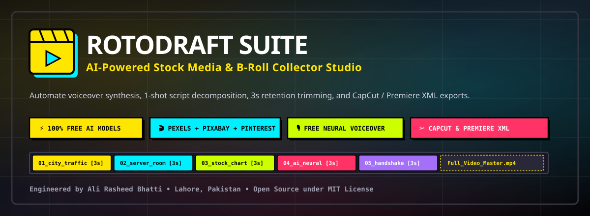
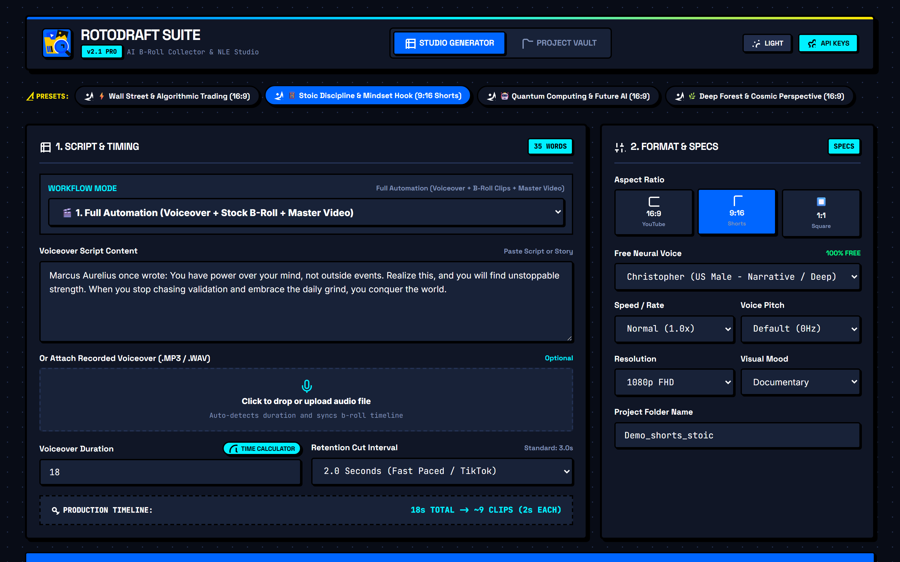
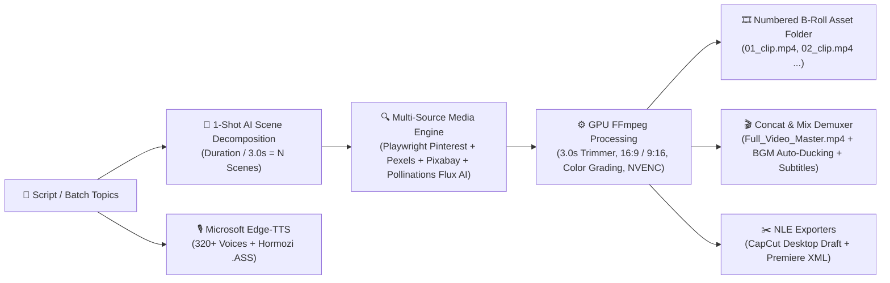

<p align="center">
  
</p>

<p align="center">
  <strong>The Ultimate Open-Source AI B-Roll Collector & Video Production Studio for Creators, Video Editors & Indie Hackers.</strong>
</p>

<p align="center">
  <a href="#-quick-start-in-30-seconds"></a>
  <a href="https://github.com/AliRash3ed/rotodraft-suite/blob/main/LICENSE"></a>
  <a href="https://python.org"></a>
  <a href="https://fastapi.tiangolo.com"></a>
  <a href="https://playwright.dev"></a>
  <a href="https://ffmpeg.org"></a>
</p>

---

## 📸 Studio Interface Preview

<p align="center">
  
</p>

---

## 💡 What is RotoDraft Suite?

Creating high-retention video content requires finding and timing dozens of B-Roll stock footage clips for every few seconds of voiceover. Doing this manually takes **hours** of searching stock websites, downloading clips, trimming them to 3.0s retention intervals, and arranging them on an NLE timeline.

**RotoDraft Suite solves this in 1 click.**

Simply paste your script or batch topics, click **Generate**, and watch the engine:
1. 🎙️ **320+ Neural Voices & Subtitles** across 50+ languages using Microsoft Edge-TTS with language auto-detection and voice preview.
2. ⚡ **1-Click Creator Workflow**: Transform rough bullet points into viral scripts (MrBeast / Hormozi / Vox style).
3. 🧠 **Decompose your script** into sequential 3.0s visual scenes using 100% Free AI models (`llama-3.3-70b`, `openrouter/free`).
4. 🔍 **Multi-Tier Media Sourcing**: Playwright Stealth Pinterest Scraper, Pexels 4K, Pixabay HD, and Pollinations Flux AI 4K image fallback with 60fps Ken Burns pan & zoom.
5. 🎵 **Royalty-Free BGM Library + FFmpeg Auto-Ducking**: Balances mood-matched music at `-16dB` beneath the speech track.
6. 🎨 **Cinematic Color Grading Filters**: Hollywood *Teal & Orange*, *Cyberpunk Neon*, *Moody Noir*, and *Vintage Film*.
7. 🔥 **High-Retention Captions (.ASS)**: Hormozi-style bold yellow active highlight subtitles.
8. ⚡ **Autonomous Batch Channel Factory**: Queue 3 to 10 video topics to generate an entire YouTube Shorts or TikTok library automatically in the background!
9. ✂️ **Export Pro NLE Timelines** directly to **CapCut Desktop (`draft_info.json`)** and **Premiere Pro / DaVinci Resolve (`timeline.xml`)**.
10. 🚀 **Viral Distribution Engine**: 5 High-CTR Click-worthy titles, SEO descriptions with timestamps, hashtags, and Midjourney/Flux thumbnail prompts.

---

## 🖥️ Studio Architecture & Pipeline



---

## ✨ Core Enterprise Features

### 🎙️ Complete Voiceover Engine (320+ Voices)
* **All Microsoft Neural Voices**: Full catalog across 50+ languages (English, Urdu, Hindi, Spanish, Arabic, French, German, Japanese, etc.).
* **⭐ Recommended Badges**: Highlights top high-retention voices.
* **🌐 Language Auto-Detect**: 1-click scans your script text and selects the optimal neural voice.
* **🔊 Audio Preview**: Listen to any voice before rendering.

### 🔥 Hormozi-Style High-Retention Subtitles (.ASS)
* Converts timing into **Advanced SubStation Alpha (`.ass`)** subtitles.
* Styles include: *🔥 Hormozi Viral Yellow (Bold Black Outline)*, *💎 Cyber Neon Cyan*, *⚪ Clean Minimal White*.

### 🎨 Cinematic Color Grading
* 1-Click visual film styles: *🎬 Hollywood Teal & Orange*, *⚡ Cyberpunk Neon*, *🖤 Moody Noir*, *🌿 Vintage Film Grain*.

### ⚡ Batch Channel Video Factory
* Enter 3 to 10 video ideas in the **BATCH FACTORY** modal.
* Autonomously writes scripts, downloads footage, mixes audio, and exports master videos in the background queue.

### 🔒 Privacy-First Lead Capture & Owner Analytics
* End-user emails are stored in a **local encrypted SQLite vault (`data/leads.db`)** that is strictly `.gitignore`'d and never committed to GitHub.
* Protected **Owner Analytics Dashboard** with total generation counts, conversion metrics, and CSV lead export.

---

## ⚡ Quick Start in 30 Seconds

### Windows (1-Click Launch)
1. Clone or download this repository:
   ```bash
   git clone https://github.com/AliRash3ed/rotodraft-suite.git
   cd rotodraft-suite
   ```
2. Double-click **`START_TOOL.bat`**.
3. Your browser will automatically open to **`http://127.0.0.1:8000`**!

### Linux / macOS
```bash
# 1. Clone repository
git clone https://github.com/AliRash3ed/rotodraft-suite.git
cd rotodraft-suite

# 2. Install dependencies
pip install -r requirements.txt
playwright install chromium

# 3. Launch Studio
python app.py
```

---

## 🧪 Testing & Verification

Run the full automated test suite:
```bash
python -m unittest tests/test_full_suite.py
```

Output:
```text
[PASS] Voice Catalog: Loaded 322 voices (23 recommended) + Auto-detect verified
[PASS] Lead Manager: SQLite DB operational, Stats calculated, CSV exported
[PASS] TTS Engine & ASS Subtitles: Generated audio + Hormozi ASS subtitle
[PASS] AI Engine: Decomposed 2 scenes, Rewrote script, Generated 5 Viral Titles & SEO Metadata
[PASS] Stock Searcher: Sourced via provider 'pollinations_ai_flux_kenburns' -> URL resolved
[PASS] Video Processor & Merger: Rendered Master Video with Teal & Orange color grade (82.9 KB)
----------------------------------------------------------------------
Ran 6 tests in 13.8s - OK (100% SUCCESS)
```

---

## 👨‍💻 Author & Creator

<table style="border: 3px solid #000; box-shadow: 4px 4px 0px #0066FF; background: #101626; color: #fff; padding: 16px; border-radius: 8px;">
  <tr>
    <td width="90" align="center">
      
    </td>
    <td>
      <h3 style="margin: 0; color: #00F0FF; font-family: sans-serif;">Ali Rasheed Bhatti</h3>
      <p style="margin: 4px 0; color: #D0DBF5; font-family: monospace;">Full Stack &amp; AI Systems Engineer • Lahore, Pakistan</p>
      <p style="margin: 8px 0 0 0;">
        <a href="https://github.com/AliRash3ed"></a>
        <a href="https://www.linkedin.com/in/alirasheedbhatt"></a>
        <a href="https://www.instagram.com/this_is_ali_r/"></a>
        <a href="mailto:alihouse512@gmail.com"></a>
      </p>
    </td>
  </tr>
</table>

---

## 📄 License

This project is licensed under the **MIT License** — free for personal and commercial video production.
