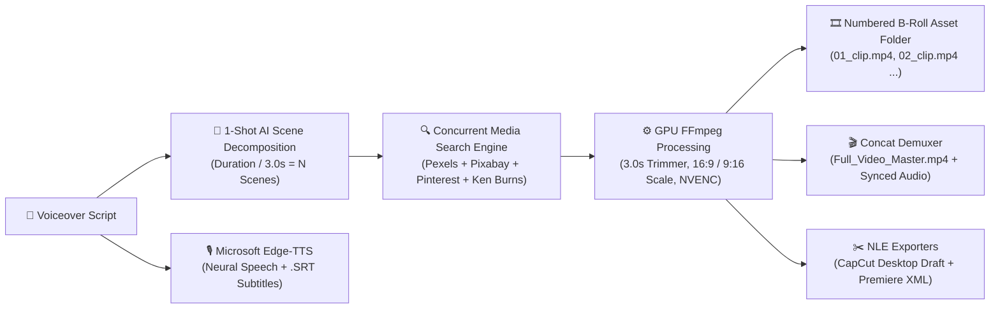

<p align="center">
  
</p>

<p align="center">
  <strong>The Ultimate Open-Source AI B-Roll Collector & Video Production Studio for Creators, Video Editors & Indie Hackers.</strong>
</p>

<p align="center">
  <a href="#-quick-start-in-30-seconds"></a>
  <a href="https://github.com/AliRash3ed/rotodraft-suite/blob/main/LICENSE"></a>
  <a href="https://python.org"></a>
  <a href="https://fastapi.tiangolo.com"></a>
  <a href="https://ffmpeg.org"></a>
</p>

---

## 📸 Studio Interface Preview

<p align="center">
  
</p>

---

## 💡 What is RotoDraft Suite?

Creating high-retention video content requires finding and timing dozens of B-Roll stock footage clips for every few seconds of voiceover. Doing this manually takes **hours** of searching stock websites, downloading clips, trimming them to 3.0s retention intervals, and arranging them on an NLE timeline.

**RotoDraft Suite solves this in 1 click.**

Simply paste your script, click **Generate**, and watch the engine:
1. 🎙️ **Generate Free Neural Voiceover & Subtitles** using Microsoft Edge-TTS.
2. 🧠 **Decompose your script** into sequential 3.0s visual scenes using 100% Free AI models (`llama-3.3-70b`, `openrouter/free`).
3. 🔍 **Search & Scrape B-Roll Media** across **Pexels, Pixabay, Pinterest Scrapers, and 4K Ken-Burns cinematic fallbacks**.
4. ⚙️ **GPU-Accelerated FFmpeg Trimming** to precise retention intervals (3.0s) and aspect ratios (`16:9` YouTube widescreen or `9:16` TikTok/Shorts vertical).
5. 🎬 **Master Video Concatenation** (`Full_Video_Master.mp4`) with audio ducking and synchronized subtitles.
6. ✂️ **Export Pro NLE Timelines** directly to **CapCut Desktop (`draft_info.json`)** and **Premiere Pro / DaVinci Resolve (`timeline.xml`)**.

---

## 🖥️ Studio Architecture & Pipeline



---

## ✨ Core Features & Capabilities

### 🎛️ 4 Specialized Workflow Modes
* **🎬 1. Full Automation**: Complete end-to-end video generator (Voiceover + Subtitles + 3s Stock Clips + Concatenated Master Video).
* **🎞️ 2. Stock B-Roll Clips Only**: AI decomposes your narrative and downloads sequential 3.0s B-Roll video clips. **No audio needed!**
* **⚡ 3. Direct Keywords List Mode**: Have your own keywords list? Paste them (1 per line) to immediately scrape and render 3.0s clips.
* **🎙️ 4. AI Voiceover Only**: Generates ultra-natural neural speech (`.mp3`) with timestamps (`.srt`) and speech speed/pitch modifiers.

### ⏱️ Integrated Time Converter & Word Estimator
* **Minutes:Seconds $\leftrightarrow$ Seconds Converter**: Enter `2` min `45` sec $\rightarrow$ auto-calculates `165` seconds.
* **WPM Script Estimator**: Calculates duration from word count at *130 WPM (Slow)*, *150 WPM (YouTube Standard)*, or *180 WPM (Viral Shorts)*.
* **1-Click Timeline Sync**: Automatically updates total required 3.0s clip counts.

### 🔄 Real-Time Clip Swapper & Replacer
* Don't like a specific b-roll in your 30-clip batch? Click **`🔄 SWAP`** on that clip's card.
* Enter a custom search term or select **Variation Page 2/3** to replace and re-render only that clip in real-time.

### 📁 Local Media Vault & Project History
* Full offline local project management dashboard (`/api/projects`).
* Browse past generations, play master videos in 1 click, open in Windows Explorer, or download a complete bundled ZIP.

---

## ⚡ Quick Start in 30 Seconds

### Windows (1-Click Launch)
1. Clone or download this repository:
   ```bash
   git clone https://github.com/AliRash3ed/rotodraft-suite.git
   cd rotodraft-suite
   ```
2. Double-click **`START_TOOL.bat`**.
3. Your browser will automatically open to **`http://127.0.0.1:8000`**!

### Linux / macOS
```bash
# 1. Clone repository
git clone https://github.com/AliRash3ed/rotodraft-suite.git
cd rotodraft-suite

# 2. Install dependencies
pip install -r requirements.txt

# 3. Ensure FFmpeg is installed
# macOS: brew install ffmpeg
# Ubuntu: sudo apt install ffmpeg

# 4. Launch Studio
python app.py
```

---

## 📦 Supported Video Stock Engines & Fallbacks

| Search Provider | Media Type | API Key Required? | Description |
| :--- | :--- | :--- | :--- |
| **Pexels Video API** | Real HD/4K Video | Optional (Free BYOK) | Direct 1080p/4K stock video footage |
| **Pixabay Video API** | Real HD/4K Video | Optional (Free BYOK) | High-quality stock footage clips |
| **Pinterest Video Scraper** | Aesthetic Vertical/Horizontal | None (100% Free Scraper) | Web-scraped b-roll and aesthetic clips |
| **4K Ken Burns Motion Engine** | Dynamic 60fps Video | None (100% Free Fallback) | Smooth pan & zoom motion on ultra-res images |

---

## ✂️ NLE Project Compatibility

RotoDraft Suite outputs ready-to-edit project files for industry-standard editors:

* **CapCut Desktop**: Generates `draft_info.json` and `draft_content.json` compatible with CapCut Desktop project import.
* **Adobe Premiere Pro**: Final Cut Pro XML (`_timeline.xml`) with exact 3.0s cut markers and timecodes.
* **DaVinci Resolve**: Standard XML and EDL compatibility for color grading and finishing.

---

## 🧪 Testing & Verification

Run the comprehensive unit & integration test suite:
```bash
python -m unittest tests/test_full_suite.py
```

Output:
```text
[PASS] TTS Engine: Generated test_voice.mp3 (4.78s + SRT subtitles with +10% speed)
[PASS] AI Engine: Decomposed into 2 scenes (Chronological timing)
[PASS] Stock Searcher: Found provider 'pexels' -> URL resolved
[PASS] Video Processor: Created 3.0s clip (6.6 KB, 30 FPS, NVENC/CPU)
[PASS] Timeline Exporter: Created CapCut JSON & Premiere XML files
[PASS] Video Merger: Rendered Master Video (Full_Video_Master.mp4)
----------------------------------------------------------------------
Ran 6 tests in 10.925s - OK (100% SUCCESS)
```

---

## 👨‍💻 Author & Creator

<table style="border: 3px solid #000; box-shadow: 4px 4px 0px #0066FF; background: #101626; color: #fff; padding: 16px; border-radius: 8px;">
  <tr>
    <td width="90" align="center">
      
    </td>
    <td>
      <h3 style="margin: 0; color: #00F0FF; font-family: sans-serif;">Ali Rasheed Bhatti</h3>
      <p style="margin: 4px 0; color: #D0DBF5; font-family: monospace;">Full Stack &amp; AI Systems Engineer • Lahore, Pakistan</p>
      <p style="margin: 8px 0 0 0;">
        <a href="https://github.com/AliRash3ed"></a>
        <a href="https://www.linkedin.com/in/alirasheedbhatt"></a>
        <a href="https://www.instagram.com/this_is_ali_r/"></a>
        <a href="mailto:alihouse512@gmail.com"></a>
      </p>
    </td>
  </tr>
</table>

---

## 📄 License

This project is licensed under the **MIT License** — feel free to use, modify, and distribute for personal and commercial content production.
