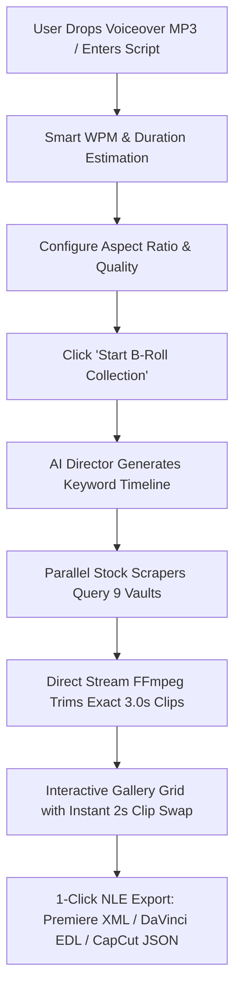

# 📑 USER REQUIREMENTS SPECIFICATION (URS)
## AI Stock Media Collector Pro / RotoDraft Suite (2026 Commercial Edition)

**Document Version:** 2.0.0  
**Author:** Ali Rasheed (Full-Stack AI Developer & Tech Infrastructure Engineer, Lahore, Pakistan)  
**Target Audience:** Video Creators, Faceless Channel Operators, Agency Editors, AI Automation Engineers  

---

## 1. 🎯 Purpose & Product Vision

Traditional video creation SaaS platforms (e.g. Pictory, InVideo, Synthesia) charge creators **$35 to $60 per month** while locking them into proprietary cloud render queues, watermarking footage, and offering limited stock platforms with zero native NLE export capabilities.

**RotoDraft Suite** was engineered to eliminate the SaaS subscription barrier by providing a **100% free, sovereign, and autonomous video asset pipeline**. It transforms dry narrative voiceover scripts into chronological, timeline-ready b-roll video clips with direct 1-click exports to Adobe Premiere Pro, DaVinci Resolve, and CapCut.

---

## 2. 👥 Target User Personas & Use Cases

### Persona A: The Faceless YouTube / TikTok Creator ("Zayn")
* **Goal:** Produces 5 to 10 automated documentary-style videos per week on topics like AI, finance, history, and science.
* **Pain Point:** Spends 4+ hours searching for matching b-roll clips on Pexels and Pixabay for every 10-minute script.
* **Requirement:** Needs to paste a 1,000-word script, drop a generated ElevenLabs audio file, click "Start", and receive 60+ perfectly trimmed 3.0s clips in under 90 seconds.

### Persona B: The Professional NLE Video Editor ("Sarah")
* **Goal:** Edits high-ticket client videos in Adobe Premiere Pro or DaVinci Resolve.
* **Pain Point:** Hates manual file importing, renaming, and placing b-roll clips sequentially onto timeline tracks.
* **Requirement:** Requires a **Final Cut Pro 7 XML** or **DaVinci Resolve EDL** file that instantly imports all clips into an organized sequence with timecodes and script segment markers.

### Persona C: The Extreme Potato PC Operator ("Hamza")
* **Goal:** Runs video generation on an older laptop with a Dual-Core CPU, 4GB RAM, and integrated graphics.
* **Pain Point:** Heavy browser-based video editors freeze the system and consume 4GB+ RAM.
* **Requirement:** The tool must execute with `BELOW_NORMAL_PRIORITY_CLASS`, keep RAM consumption ≤ 50MB, and transcode media safely without freezing the mouse cursor or operating system.

---

## 3. 🗺️ Core User Workflows & Acceptance Criteria

### Workflow 1: Voiceover & Pacing Estimation
* **User Requirement (UR-1.1):** When a user types or pastes a script, the system must calculate word count and estimate duration at 150 words per minute (WPM).
* **User Requirement (UR-1.2):** If the user drops an `.mp3` or `.wav` audio file, the system must probe the exact duration using the browser's audio engine and auto-populate the total duration field.
* **Acceptance Criteria:** Audio drop must complete duration detection in `< 200ms` without server roundtrip.

### Workflow 2: Visual Selection & Aspect Ratio Toggles
* **User Requirement (UR-2.1):** User must be able to switch aspect ratios (`16:9 Landscape`, `9:16 Vertical Shorts/Reels`, `1:1 Square Instagram`) with a single click on a visual button.
* **User Requirement (UR-2.2):** User must be able to select resolution (`720p HD`, `1080p FHD`, `4K UHD`) with instant dynamic ETA recalculation.
* **Acceptance Criteria:** Aspect ratio and quality buttons must provide active visual feedback with physical button press animation.

### Workflow 3: Parallel Collection & Live Progress Feedback
* **User Requirement (UR-3.1):** User must see a real-time progress bar with 4 live milestone counters:
  1. **Keywords Extracted** (AI Brain)
  2. **Assets Searched** (9 Vaults)
  3. **Streams Downloaded** (Parallel Async)
  4. **Clips Rendered** (Local FFmpeg)
* **Acceptance Criteria:** UI must update every second without full page reloads via lightweight polling.

### Workflow 4: Single-Clip Micro Swap (~2s Regenerate)
* **User Requirement (UR-4.1):** If the user is dissatisfied with any individual clip on the timeline, they must be able to click **"🔄 Swap"**, enter a new search keyword, and regenerate **only that single clip** in ~2 seconds without re-running the entire video pipeline.
* **Acceptance Criteria:** Swap execution must update the thumbnail and video file in place and trigger a floating toast notification.

### Workflow 5: 1-Click NLE Export Suite
* **User Requirement (UR-5.1):** User must be able to download Final Cut Pro XML (`.xml`), DaVinci EDL (`.edl`), CapCut Draft (`.json`), or a consolidated `.zip` archive with 1 click.
* **Acceptance Criteria:** Exported files must open natively in Premiere Pro, DaVinci Resolve Studio, and CapCut Desktop with zero media relink errors.

---

## 4. 🎨 User Experience & Design Guidelines

1. **Aesthetic Tone:** Neo-Brutalism with shadcn/ui refinement (High-contrast 2px/3px black borders, crisp 4px/5px hard drop shadows, curated HSL color accents).
2. **Zero Clutter:** No triple-arrow redundancy, no unstyled emojis as interface icons, and no overlapping sticky navbars.
3. **Single-Page Navigation:** Distinct, isolated view tabs for **Studio Workstation**, **Showcase & Features**, **About Developer**, and **Contact / Hire Me**.

---

## 5. 🔒 Non-Functional User Expectations

* **Zero SaaS Tax:** 100% free open-source software under MIT License.
* **Sovereign Privacy:** API keys and video footage stay strictly on the local machine; zero analytics telemetry.
* **Offline Resilience:** If an API key is missing or quota is exhausted, the system automatically fails over to royalty-free scraping vaults without failing the user's job.

---

*Verified and Approved for Technical Implementation.*
